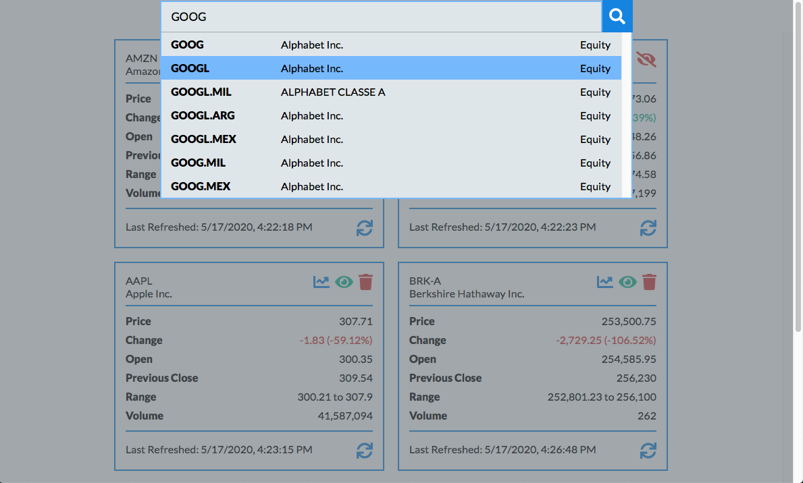
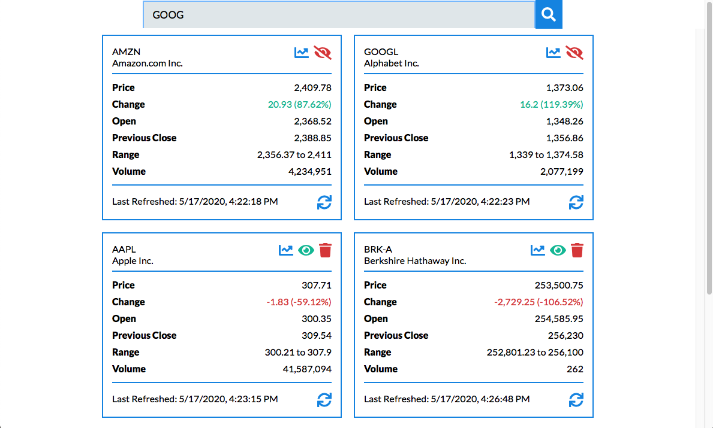
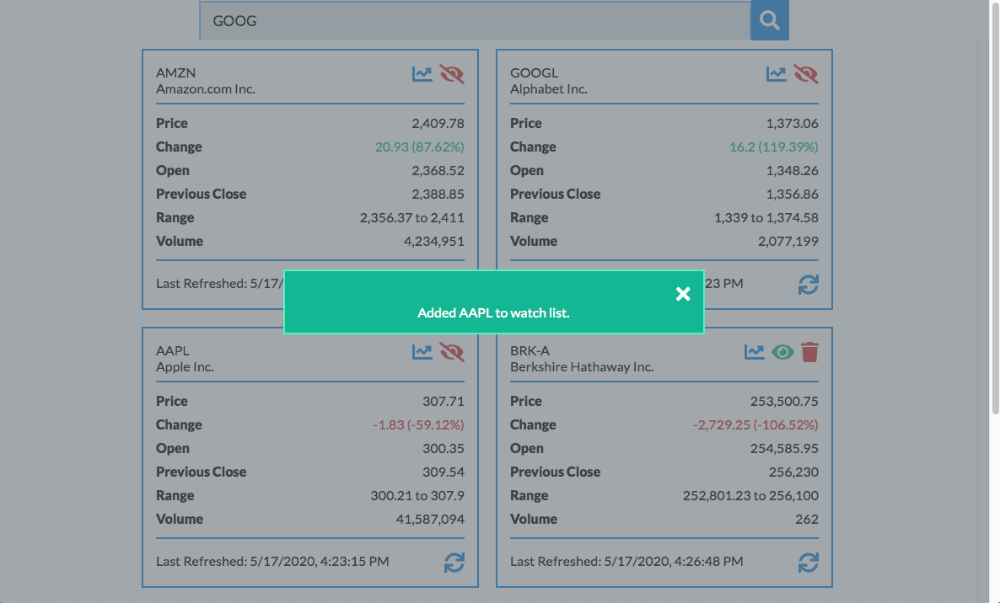
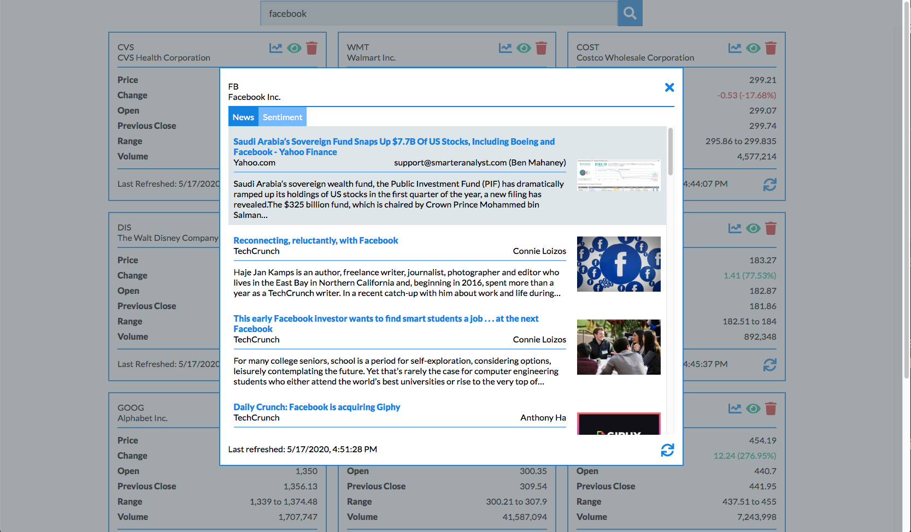
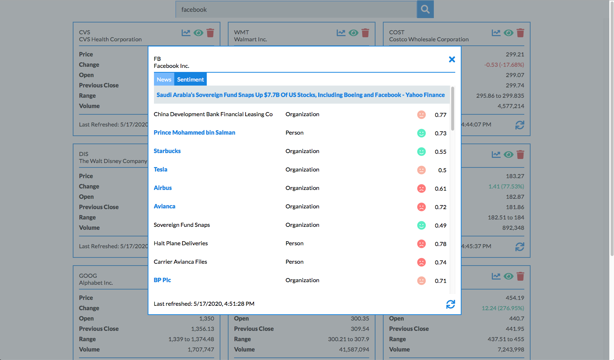

# Stock-Analysis
[Project] Analyze your stock portfolio! 

Practice project using JavaScript/Sass frontend, Node.js/Express backend, and a Webpack configuration. The original assignment was from Udacity's Front End Nanodegree Program, which asked students to create a custom travel application. I diverged from the original prompt and created an application with the following features:

## Features

### Security Search

        - Users can search for securities by symbol and are shown a list of matching symbols returned by the Alpha Vantage API. 
        - When the user clicks on one of the symbols in this list, they will be shown a card containing information about the security.

### Quote Cards

        - Users can view a list of recently searched securities, which are presented to the users as cards. 
        - Users can refresh the card and fetch the latest data for any searched security every 15 minutes.

        
### Watching Securities

        - Users can clear recently searched securities, as well as add and un-watch securities of their choice. 
        - On page refresh, the user's list of watched securities will be fetched from the server, and the corresponding cards displayed on the screen.

### Detailed Insights

        - Users can view a news feed containing breaking and recent (past three days) news about the security. 
        - Users can view sentiment analyses on breaking news, which includes a list of entities referenced in each article and the article's sentiment towards these entities.
        - Each security's news feed can be refreshed every 60 minutes.

## APIs Used
        
        Alpha Vantage: https://www.alphavantage.co
        Aylien: https://developer.aylien.com
        News API: https://newsapi.org/

## Build Steps

To get Webpack running:

        npm run build / npm run dev
        npm start